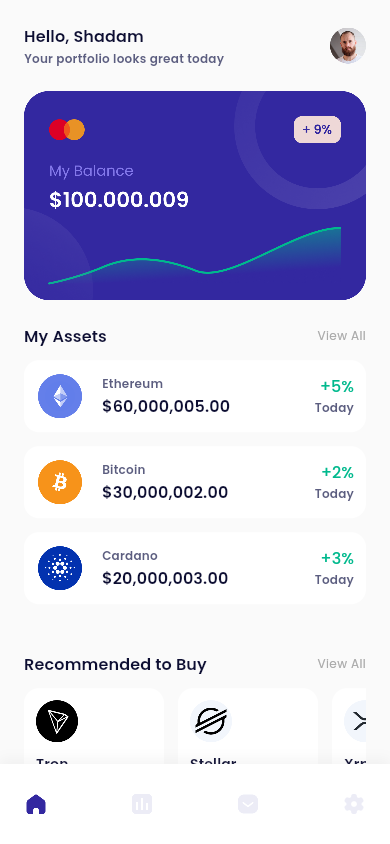

# Simple Crypto Portfolio App

A modern, clean cryptocurrency portfolio application built with Flutter. This project demonstrates Clean Architecture principles, state management with Provider, and responsive UI design.



## Features

-   **Clean Architecture**: Separation of concerns into Data, Domain (implied), and Presentation layers.
-   **State Management**: efficient state handling using `Provider`.
-   **Responsive UI**: Custom `BottomNavigationBar` and `CustomScrollView` for a smooth user experience.
-   **Theming**: Centralized theme management for easy styling updates.
-   **Unit & Widget Testing**: Comprehensive test coverage for core logic and UI components.

## Technical Stack

-   **Framework**: Flutter
-   **Language**: Dart
-   **Dependencies**:
    -   `provider`: For state management.
    -   `intl`: For currency formatting.
    -   `google_fonts`: For typography.

## Getting Started

1.  **Clone the repository**:
    ```bash
    git clone https://github.com/yourusername/simple_crypto.git
    ```

2.  **Install dependencies**:
    ```bash
    flutter pub get
    ```

3.  **Run the app**:
    ```bash
    flutter run
    ```

## Project Structure

```
lib/
├── core/
│   └── theme/          # App theme and colors
├── data/
│   ├── models/         # Data models (Crypto, Recommendation)
│   └── repositories/   # Data repositories
├── presentation/
│   ├── providers/      # State management (HomeProvider)
│   ├── screens/        # UI Screens (MainScreen, HomeScreen)
│   └── widgets/        # Reusable widgets
└── main.dart           # Entry point
```
